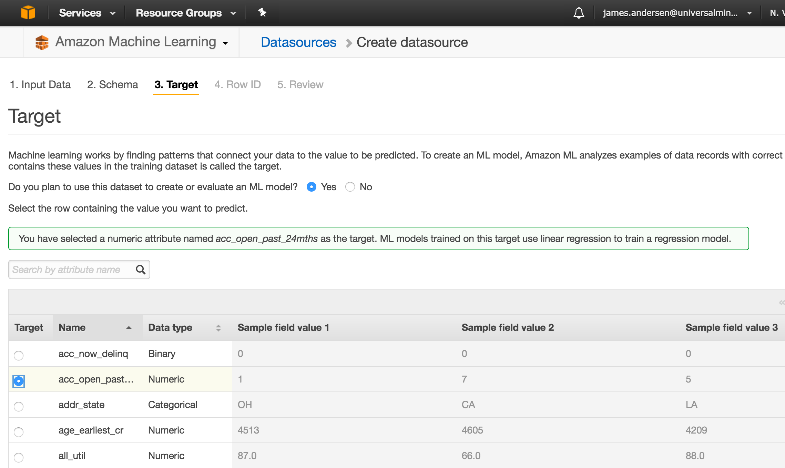
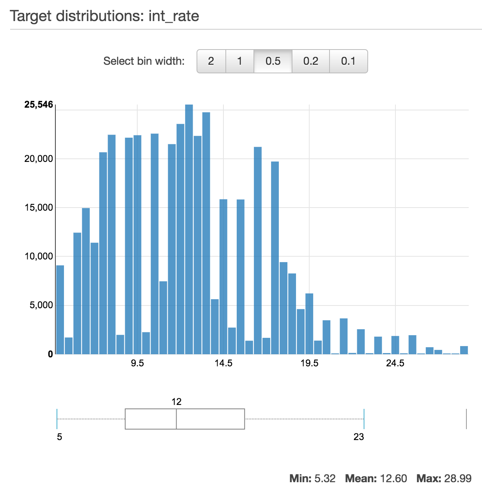
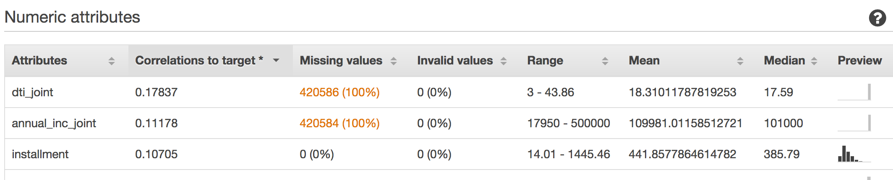

# Data Source
AWS machine learning data sources are comma-separated (.csv) data files stored in an S3 bucket.  Some integration with RedShift and RDS sources is also available but ultimately those sources will be exporting .csv files to S3.   The AWS console Datasource wizard will prompt you for:

1. The location of your data file in S3; the service will need permissions to access the file of course but the console wizard can set these for you.
2. Whether your data file contains a header row
3. Whether it has corrected detected appropriate schema from sampling your data.  Each column will be identified as one of the following types and you can adjust the schema if AWS guesses incorrectly:
   * Text - Free form text data such as the applicant's description of the loan `desc` or job title (`emp_title`).
   * Categorical - One of a discrete set of values.  Two examples from our sample loan data:
      * The loan "letter grade" (`grade`) with values in the range A - G
      * The applicant's home ownership status (`home_ownership`) which has the possible values RENT, OWN, MORTGAGE and OTHER
   * Numeric - Numeric data values on a continuous scale such as the loan interest rate (`int_rate`) or applicant's annual income (`annual_inc`)
   * Binary - Simple on/off, yes/no type values
4. A **target attribute** that you'll be training a machine learning model to predict.  You *can* use the same data file for multiple AWS ML data sources but each datasource is configured for only a single *target attribute*.  In this walkthrough we use the same .csv file to create two datasources:
   * One identifies the interest rate, a *numeric* variable, as the target attribute and will be used in the prediction of interest rate
   * The other identifies the loan grade, a *categorical* attribute, as the target attribute and will be used to predict which of the seven possible loan grades is most appropriate.
   

Once you’ve stepped through the Datasource creation wizard, the datasource will be in a pending status for a period of time while AWS generates some useful descriptive statistics.  For example the distribution of your target attribute, the correlation of all other attributes to your target attribute, whether there are missing values which may interfere with the quality of your machine learning model. 

