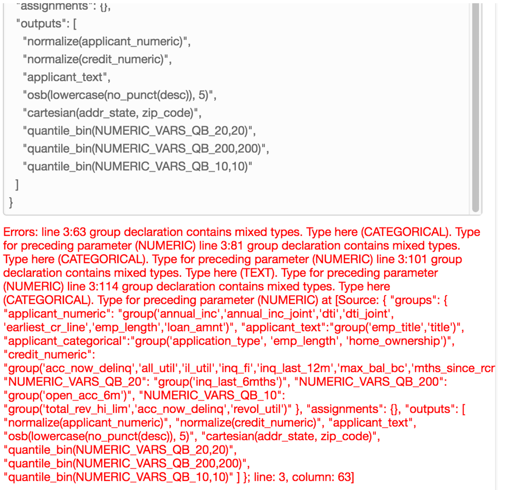

# Gotchas and Limitations

## Gotchas
* *Supervised Regression Only* - The service only offers supervised regression models at present.  For neural nets, KNN, or anything else more exotic try the [AWS Deep Learning AMI](https://aws.amazon.com/marketplace/pp/B01M0AXXQB).
* *No Model Export* - You can't export the model e.g. if you wanted to simply use a trained model outside of the ML service you can’t…
* *Not Cloud Formation Enabled* - If you wanted to incorporate an AWS ML into a cloud formation script... unfortunately this doesn't aNot yet CF enabled
Can’t modify the data transformation “recipe” of an existing datasource? (at least with the console?)
* *Recipe validator is a little “rough”*
