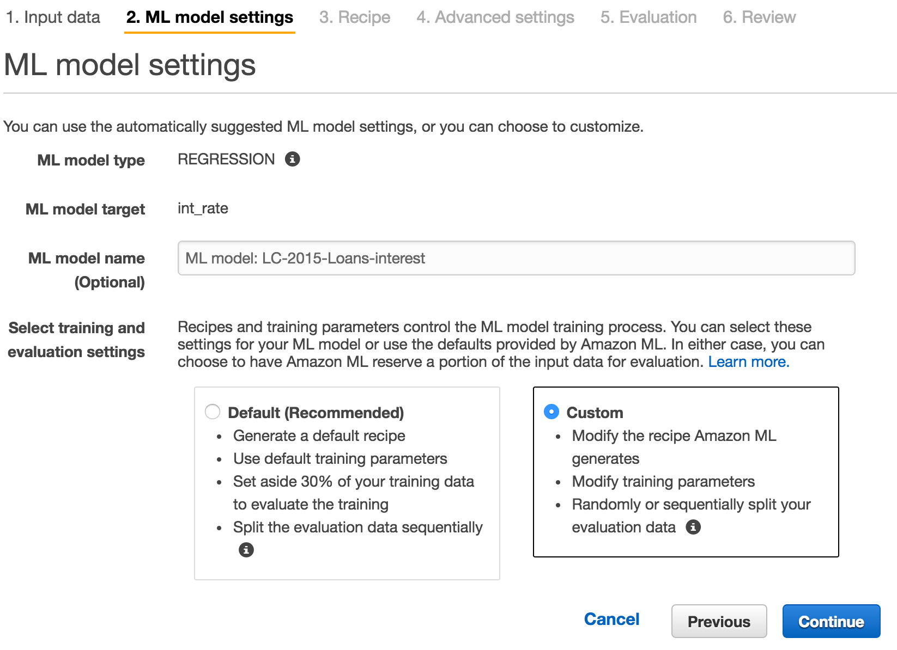
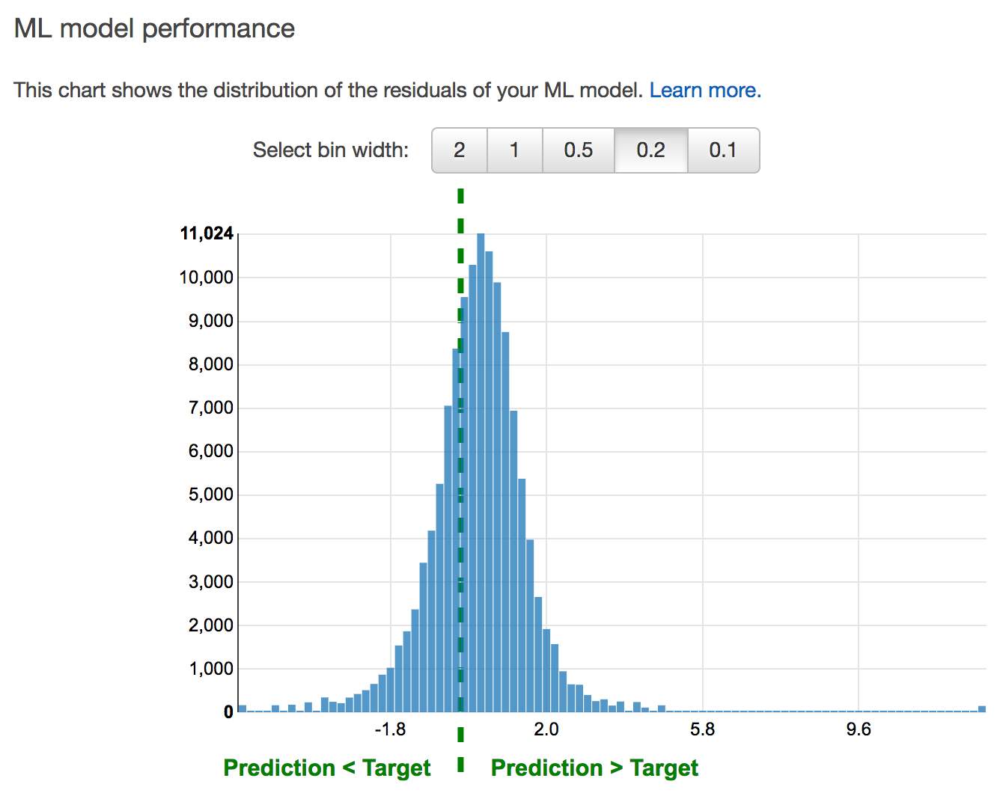
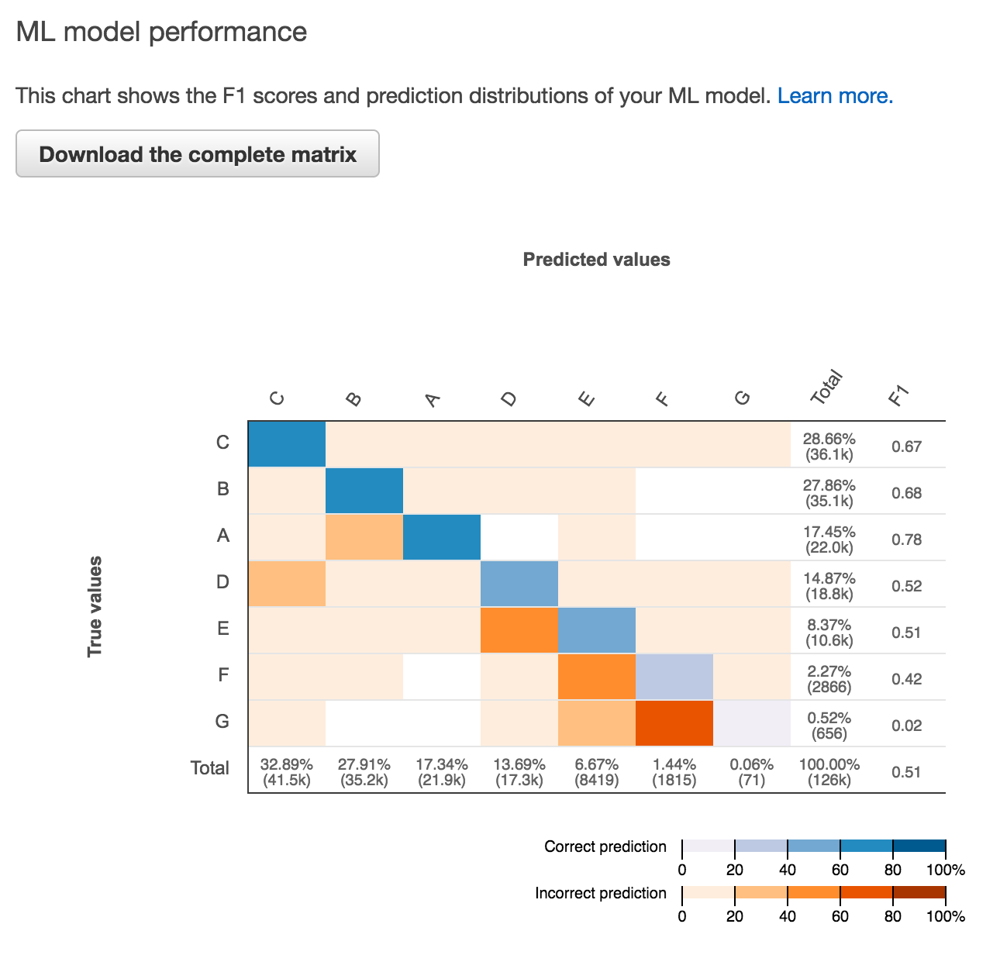

# Creating the Machine Learning Model
With our datasource built on our scrubbed data file ready to go we’re ready to finally create a machine learning model.  The AWS console walks you through the steps but we’ve got a few decisions to make beyond just selecting our datasource.  AWS refers to the mix of variables, from those available in the datasource,  that will be used to train the model as a “recipe” and offers a default recipe.

However, our loan data set, drawn from existing loans, includes some data we don’t want to incorporate into the model such as the next loan payment, whether the borrower has been late, how the principal was financed by the loan issuer, etc.   We only want to use data that will be available when predicting interest rates so only applicant and credit report data is valid for use.   We’re going to need to create a custom “recipe”.   Check out the[AWS docs for details on the recipe format](http://docs.aws.amazon.com/machine-learning/latest/dg/data-transformations-for-machine-learning.html); it’s not the most straightforward and the editor in the AWS console is a little raw from a user experience standpoint but essentially the recipe consists of groups of variables you want the model to consider.  There is a validation step to help identify recipe errors as well.

## Custom Recipe
After removing several attributes from the dataset that we would **not** have present when trying to make a loan interest rate or loan grade prediction, such as those related to servicing of existing loans, we end up with the following custom recipe:
[custom-model-recipe.json](custom-model-recipe.json)

A custom recipe also allows you to use data transformations that are built into the AWS machine learning service. Here are a couple that we used in our demo:
 
* **normalize()** - Our loan data contains some variables measured in dollars and others that are counts of open credit lines.  However, comparing two applications, we know intuitively that a $10 change in a credit card balance isn’t as significant as 10 additional derogatory remarks on a credit report.  The value range for these two variables are drastically different and normalize() helps the model avoid giving undue weight to variables which simply have a larger range of values.
* **quartile_bin()** - We also know that a $10 variation in the loan amount is probably not extremely influential in two otherwise equal loan applications.   It may be more useful to group some of our numeric data into “bins” e.g. loans between $0 and $10K, $10K and $20K, etc and then just consider which group the application falls into.   The quartile_bin() transformation creates these groups on the fly which are then treated as categorical variables rather than numeric.

Next up the console will prompt for some additional training parameters such as how to divide the data into a [training and test sets](https://en.wikipedia.org/wiki/Test_set). Refer to the [AWS training parameter docs](http://docs.aws.amazon.com/machine-learning/latest/dg/training-parameters.html) for details.
 
Having stepped through the AWS machine learning model wizard, our newly created model will now be in a pending state for a period of time while AWS trains our model and evaluates it using the portion of our data designated as the “test set”.   For the loan data set this typically took around 30 minutes.  
 
After the training and evaluation the AWS console shows us how the interest rate predictions from our model compare with the actual interest rates from our test set.   In this case, the model is “pretty good”; it predicts an interest rate that is not off by much for most of the data.  It does appear to be skewed high e.g. the prediction is higher than the actual interest rate more often than not.

The second model we trained for the demo attempts to predict the loan grade rather than the interest rate.   In this case our model’s performance is presented as a “confusion matrix” which identifies where our model predicted the correct loan grade and where it went awry.   Here the blue diagonal line is signal of the model predicting correctly most of the time.  The dark orange square at the intersection of G on the left axis and F on the top axis indicates that our model incorrectly predicted a large number of G grade loans as being F.  This would prompt some follow-up analysis of the data and/or discussions with domain experts who know what distinguishes between an F and a G grade.  Perhaps we need additional data captured in the model or can calculate some additional features that will improve the performance.

The performance data offered here helps us determine if our model is suitable for our business needs.  Are these predictions good enough for some kind of contingent loan approval that might keep customers from looking to the next option in their search results?  The answer is of course a business decision but if they are not, we may need to iterate again through some analysis of the data and work to improve the quality of the model.