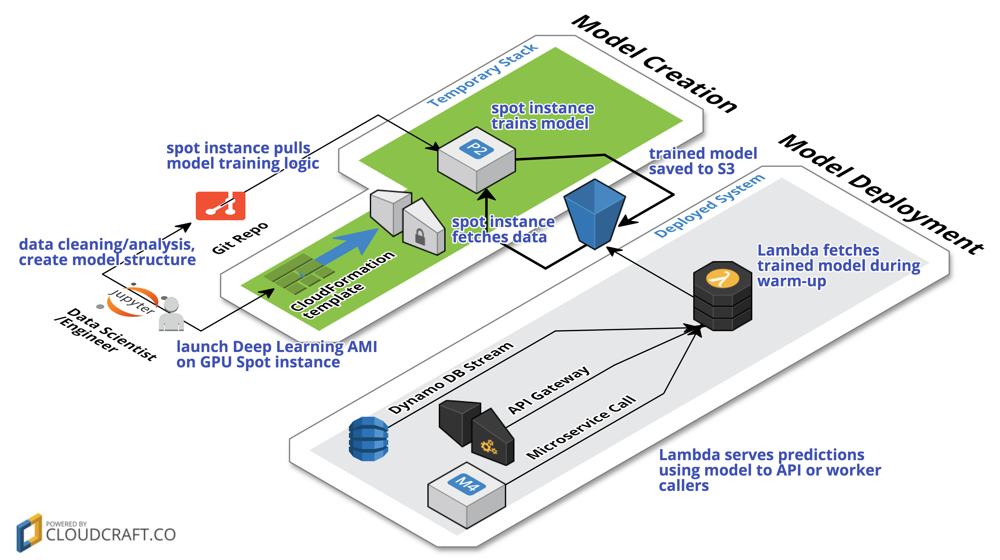

# AWS Maching Learning Service Walkthrough
This is a simple walkthrough intended to introduce [Amazon's Machine Learning service](http://docs.aws.amazon.com/machine-learning/latest/dg/what-is-amazon-machine-learning.html) in the context trying to predict loan interest rates and grades. This is a **managed** service that can be useful in basic regression models used for predictions.

We’re going to use some [publicly available loan applicant data](https://www.lendingclub.com/info/download-data.action) from Lending Club.  The data set I’ve chosen contains over 420,000 loans with data such as applicant annual income, loan term, state of residence, credit score range and a number of other credit data, etc.  The dataset also contains a letter grade classification of the loan in the range A - G.  We’re going to use AWS machine learning to build two models, one that will predict an appropriate interest rate and a second that will infer the letter grade for the loan application.

1. [Creating a Datasource](Create-Datasource.md)
2. [Data Cleaning and Feature Engineering](Cleaning-Features.md)
3. [Creating the Machine Learning Model](Model-Creation.md)
4. [Gotchas and Limitations](Gotchas-Limitations.md)

# Custom AWS Machine Learning Pipeline

This repo also outlines how to create and deploy a **custom** machine learning pipeline using [Keras](https://keras.io/) (with [Tensorflow](https://www.tensorflow.org/) backend) and [AWS Lambda](https://aws.amazon.com/lambda/).   It uses the same loan dataset but ends up with much more accurate results through the use of a neural network.  See [the Machine Learning Pipeline README](keras-deeplearning/README.md) for more details.

