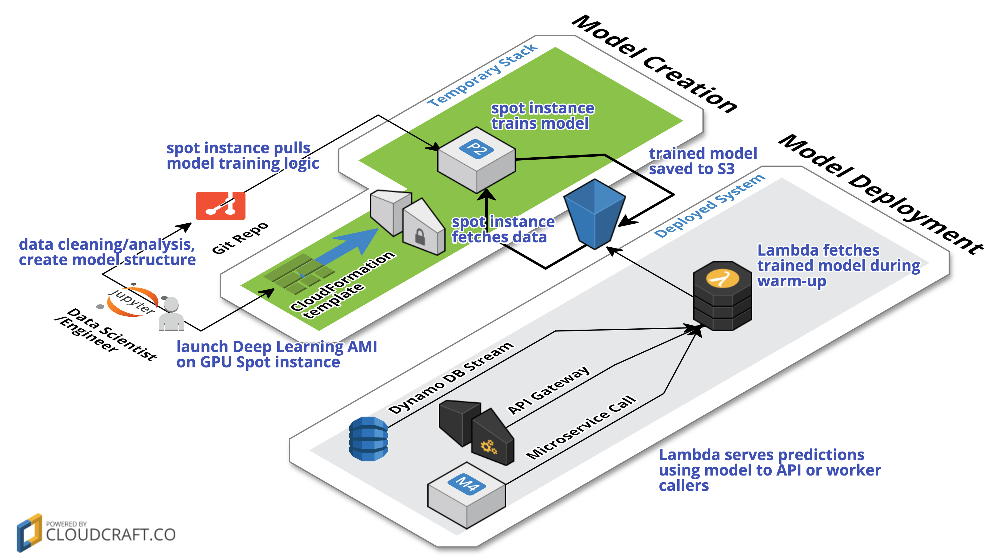

# Machine Learning Pipeline on AWS
This part of the repo is focused on using [Keras](https://keras.io/) (with [Tensorflow](https://www.tensorflow.org/) backend) and AWS Lambda to build a custom machine learning pipeline.

See the following for additional detail:
* [Building and Training a Model](train-model/model-creation.md)
* [Deploying a Model](deploy-model/model-deployment.md)

Also checkout these great resources on Keras:
* [Keras Tutorial: Deep Learning in Python](https://www.datacamp.com/community/tutorials/deep-learning-python#gs.iIbKfbo)
* [Multi-Class Classification Tutorial with the Keras Deep Learning Library](https://machinelearningmastery.com/multi-class-classification-tutorial-keras-deep-learning-library/)